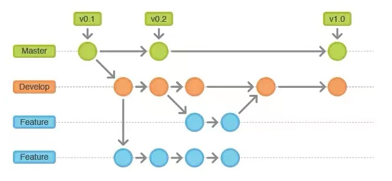
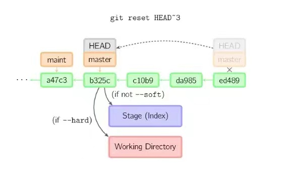

# Git联合VScode使用

## Visual Studio Code
VSCode是一款微软出的轻量级编辑器，它本身只是一款文本编辑器而已，所有的功能都是以插件扩展的形式所存在，想用什么功能就安装对应的扩展即可，非常方便，同时也支持非常多的主题和图标，外观比较好看，重要的是VSCode支持各大主流操作系统，包括Windows、Linux和Mac OS。所以就选择它作为自己的一款主要的编辑器来使用。

### VS Code安装
1.到官网<https://code.visualstudio.com/>下载合适的版本并下载


2.登陆github账户，同步个人设置。

### Git安装
按照git使用和理解.md中的方法，安装合适系统的Git，熟悉git常用的命令，对于git的基本逻辑理解。  

任何对象都是在工作区中诞生和修改。  
任何修改都是从index区才可以被版本控制。 
只有把修改提交到本地仓库，该修改才能在仓库中留下痕迹。  
与写作者分享本地的修改，才可以把他们push到远程库来分享。 
 

1. 查看git当前版本
   ```
   git -v
   git config --list #查看config配置

   git config --global user.name="" #全局配置

   git init #初始化当前目录
   ```
2. git 克隆远程仓库
   ```
   git clone git@github.com:erwinQiao/gitLearn.git

   git remote add origin git@github.com:erwinQiao/gitLearn.git #本地与远端关联
   ```
3. git 操作常用代码
   ```
    git status #查看当前仓库文件状态

    git log #查看log日志信息

    git log --oneline --graph --author="", #图形化，简单化，并且可以搜索作者的log查看

    git reflog # 查看commit信息

    git add . #添加所有已修改的文件

    git add <filename> #添加指定文件名的文件

    git commit -m "message" #记录当前提交的主题，用来区分

    git commit -a #git add+git commit

    git pull #拉去远程库，更新本地库

    git pull <远程名称> <远程分支> #指定库的分支

    git push #是和pull相反的操作，上传到远程仓库

    git fetch <remote> <branch> #抓取所有的commit 

    ```
4. 分支操作
   ```
   git checkout -b dev  #新建分支并切换

   git switch -c dev #新建dev分支并且切换

   git push origin dev:dev #推送分支到远程分支

   git branch #查看分支

   git branch -d dev #在完成后删除分支

   git branch -D dev #强制删除分支

   git push origin --delete dev #删除远程分支

   git branch -d -r origin/dev #删除远程分支

   git checkout --track origin/dev #本地跟踪远程分支

   git push --set-upstream origin dev #将本地分支推送到远程
   
   git tag #列出所有版本的标签

   git tag <tag name> #基于最新提交创新标签

   git status
   git add .
   git commit -m ""
   git pull
   git merge dev
   ```

5. 修改常用的命令
   ```
    git commit --amend -m <message> #使用一次新的commit，替代上一次的提交

    git rebase #衍合 通俗的讲就是dev分支向站在master的肩膀上继续下去，就是merge上master之后，继续在dev上

    #如果你想要干净的，没有merge commit的线性历史树，就要选择rebase
   ```

```
git reset #常用的返回命令

git reset --hard HEAD^ #直接回到上次commit状态，但是没有暂存

git reset --soft HEAD^ #回到index，是add之后，有缓存

git revert  #是比较温和的修改方式，回回滚之前commit，而不是删除
```

## VS Code使用
1.按照之前的操作，构建好远端仓库；Github添加好公钥；电脑上安装好Git；设置好git参数。

可以在本地进行推送远端仓库
```
git init
git add .
git commit -m "init"
git remote add github git@github.com:erwinQiao/gitLearn.git
git push -u github master
```
也可以在远端构建好仓库，激活之后，使用
```
git clone git@github.com:erwinQiao/gitLearn.git
```

文件夹构建好之后，可以在VScode中打开这个文件夹  


也可以在文件夹中使用Git bash，进入git bash界面，输入code \<filename>即可跳转到VSCode软件中，直接打开文件。
  

2.进入VScode之后，对应有所有的可视化git命令行图标


在资源管理器中，文件夹位置有新建文件夹/文件，直接点击就是新建。


在新建文件/文件夹之后，U显示的就是untraced,就是对应git status中未追踪的文件。  

  
点击分支符号，看到test状态，旁边的+就是相当于git add，返回符号就是撤回。

  
点击+ 相当于git add，然后提交相当于git commit，上面输入消息就相当于-m，然后提交之后就完成了git commit。


